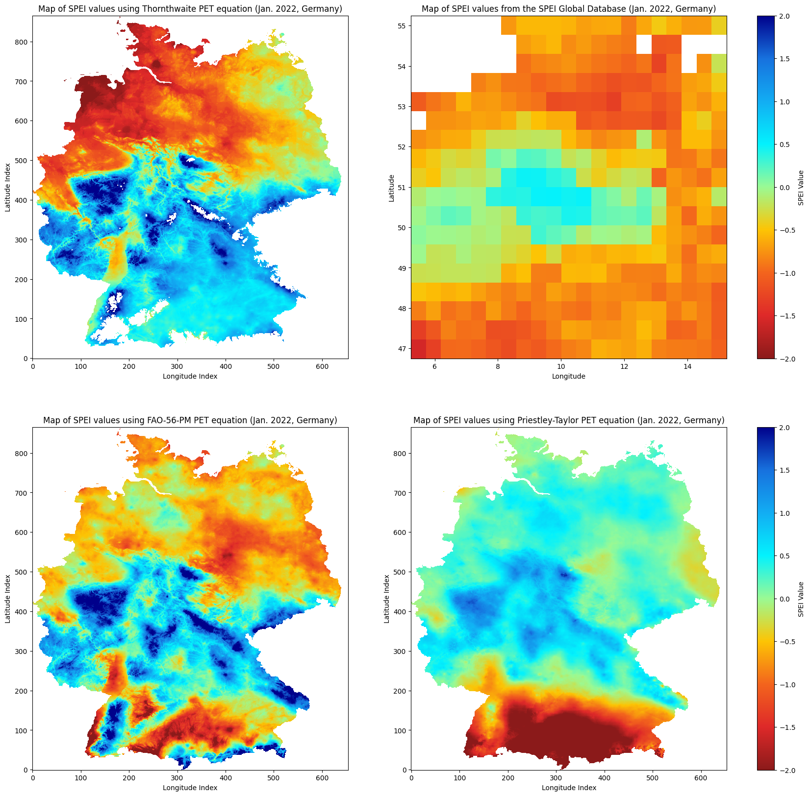
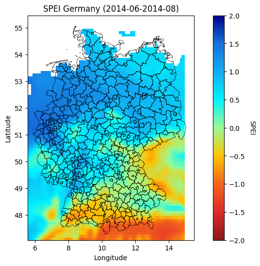

# Drought detection and prediction in Germany
This project is about detecting and predicting droughts in Germany. The drought index used in this project is the Standardized Precipitation Evapotranspiration Index (SPEI) by [Vicente-Serrano et al.](https://spei.csic.es/index.html) [[1](https://rmets.onlinelibrary.wiley.com/doi/full/10.1002/joc.3887)].

*All files, scripts or notebooks that are not mentioned in this [README.md](README.md) are utils files or were used for testing and experimenting.*

## Table of Contents
1. [Standardized Precipitation Evapotranspiration Index (SPEI)](#standardized-precipitation-evapotranspiration-index-spei)
2. [Drought detection](#drought-detection)
    1. [Drought detection - Jupyter Notebooks](#drought-detection---jupyter-notebooks)
3. [Drought prediction](#drought-prediction)
    1. [Drought prediction - Jupyter Notebooks](#drought-prediction---jupyter-notebooks)
4. [Setup](#setup)
    1. [Setup - Download datasets](#setup---download-datasets)
    2. [Setup - Environment](#setup---environment)
    3. [Setup - Configure datapaths](#setup---configure-datapaths)


# Standardized Precipitation Evapotranspiration Index (SPEI)
The SPEI is a drought index that indicates whether the specific region is in a drought, normal or wet condition. First the Potential Evapotranspiration (PET) needs to be calculated. It is the amount of water that could potentially evaporate from the soil and transpire from the plants if it was available. 

For example the PET can be calculated with the Thornthwaite equation. The Thornthwaite equation is based on temperature and empirical data.

By subtracting the PET from the observed precipitation, the water balance can be calculated. Over different time scales (*e.g. 1 month, 3 months, 6 months, 12 months*) the water balance is accumulated to capture short-term and long-term drought conditions.

After that a probability distribution will be fitted to the accumulated water balance values. Commonly the log-logistic distribution is used:

<p align="center">
  
</p>

where `x` is the accumulated water balance, `μ` is the location parameter and `σ` is the scale parameter. The SPEI is then calculated by transforming the accumulated water balance values to the standard normal distribution.

<p align="center">
  
</p>

where `F` is the cumulative distribution function of the log-logistic distribution and `F⁻¹` is the inverse cumulative distribution function of the standard normal distribution.

The SPEI is a standardized index, which means that it is unitless and can be compared across different regions and time scales. [[1](https://rmets.onlinelibrary.wiley.com/doi/full/10.1002/joc.3887)]

# Drought detection
For the detection of a drought the SPEI is used. The SPEI indicates a drought, normal or wet condition when a specific value is reached.

| SPEI value | Condition     |
|------------|---------------|
| x <= -2.0 | Extreme drought      |
| -1.99 <= x <= -1.50  | Severe drought |
| -1.49 <= x <= -1.0  | Moderate drought |
| -0.99 <= x < 0.99   | Normal       |
| 1.0 <= x <= 1.49    | Moderately Wet          |
| 1.50 <= x <= 1.99    | Severely wet      |
| 2.0 <= x    | Extremely wet |

 \
*Visual comparison between the Thornthwaite, FAO-56-Penman-Monteith, Priestley-Taylor and Global SPEI Database plot results which have been calculated using meteorological weather stations's data from the DWD.*

 \
*SPEI calculation's plot result using remote sensing data from NASA-GPM and ERA-5 Land for September 2014.*

## Drought detection - Jupyter Notebooks
1. **SPEI Meteorological - Calculation:** [methods/meteorological/spei_meteorological.ipynb](methods/meteorological/spei_meteorological.ipynb) [[Git](https://github.com/JustinTrvz/drought-detector/blob/develop/methods/meteorological/spei_meteorological.ipynb)]
    - In this notebook the SPEI will be calculated for the region of Germany using meteorological data from the [DWD](https://opendata.dwd.de/climate_environment/CDC/) (*Deutscher Wetterdienst*).
    - For each SPEI result using a different PET equation a map plot of Germany has been created to demonstrate how a SPEI map looks like.
    - All SPEI results were visually compared to the [Global SPEI Dataset](https://spei.csic.es/database.html) which has been created by the inventors of the SPEI index [Vicente-Serrano et al.](https://spei.csic.es/index.html).

2. **SPEI Meteorological - Comparison:** [ddata_comparison/compare_spei_meteorologcial.ipynb](data_comparison/compare_spei_meteorologcial.ipynb) [[Git](https://github.com/JustinTrvz/drought-detector/blob/develop/data_comparison/compare_spei_meteorologcial.ipynb)]
    - In the following notebook the calculated SPEI with the different PET equations using meteorological data is compared to the offical [Global SPEI database](https://spei.csic.es/database.html). The PET equations "FAO 56 Penman-Monteith", "Thornthwaite", "Priestley-Taylor" and "Hargreaves" were used for the calculation.
    - The minimum, maximum and average SPEI values are compared. Aswell as the distribution of the SPEI values.

3. **SPEI Remote Sensing - Calculation:** [methods/method1/spei_calc_multi_months.ipynb](methods/method1/spei_calc_multi_months.ipynb) [[Git](https://github.com/JustinTrvz/drought-detector/blob/develop/methods/method1/spei_calc_multi_months.ipynb)]
    - In this notebook the SPEI will be calculated for the region of Germany using remote sensing data from the [NASA-GPM mission](https://gpm.nasa.gov/missions/GPM) and the [ERA5-Land reanalysis](https://cds.climate.copernicus.eu/cdsapp#!/dataset/reanalysis-era5-land-monthly-means?tab=overview).
    - For each SPEI result using a different PET equation a map plot of Germany has been created to demonstrate how a SPEI map looks like.
    - Only the "Thornthwaite" and the extended "Thornthwaite" PET equations were used for the calculation because the used datasets only provide temperature and precipitation values.

4. **SPEI Remote Sensing - Comparison:** [data_comparison/compare_spei_remote_sensing.ipynb](data_comparison/compare_spei_remote_sensing.ipynb) [[Git](https://github.com/JustinTrvz/drought-detector/blob/develop/data_comparison/compare_spei_remote_sensing.ipynb)]
    - In the following notebook the calculated SPEI with the different PET equations using remote sensing data is compared to the offical [Global SPEI database](https://spei.csic.es/database.html). 
    - The minimum, maximum and average SPEI values are compared. Aswell as the distribution of the SPEI values.

# Drought prediction
For the prediction of the SPEI, a Gradient Boosting Regressor is used.

A Gradient Boosting Tree (GBT) is a machine learning technique used for regression and classification tasks. It builds an ensemble of decision trees in a sequential manner, where each new tree corrects the errors made by the previous trees. This is achieved by minimizing a loss function through gradient descent, allowing the model to improve accuracy iteratively. The final model is a weighted sum of the individual trees, leading to robust and high-performing predictions.

## Drought prediction - Jupyter Notebooks
1. **Gradient Boosting Tree - Prediction:** [methods/method2/gbt_spei.ipynb](methods/method2/gbt_spei.ipynb)
    - The Jupyer Notebook demonstrates how a Gradient Boosting Tree can be used to predict the SPEI for the region of Germany.
    - Boxplots were created to visualize the prediction results distribution and the outliers.
2. **Gradient Boosting Tree - Comparison:** [methods/method2/gbt_comparison.ipynb](methods/method2/gbt_comparison.ipynb)
    - This notebook compares the prediction results of the Gradient Boosting Tree with the actual SPEI values from the [Global SPEI database](https://spei.csic.es/database.html).
    - Graphs and boxplots were created aswell to compare the prediction results of the Gradient Boosting Tree with the actual SPEI values.

# Setup
Due to licensing reasons I cannot host the datasets I used in this project, so for testing and research purposes you need to download the datasets and use the provided notebooks from this project..

## Setup - Download datasets
1. Get the required datasets from [DWD](https://opendata.dwd.de/climate_environment/CDC/), [NASA-GPM](https://gpm.nasa.gov/missions/GPM) and [ERA5-Land](https://cds.climate.copernicus.eu/cdsapp#!/dataset/reanalysis-era5-land-monthly-means?tab=overview).

## Setup - Environment
1. Install Python >= 3.10, Python Venv and Pip.
    ```bash
    sudo apt install python3 python3-venv python3-pip
    ```
2. Clone the Git repository via HTTPS or SSH:
    ```bash
    ## via HTTPS
    git clone https://github.com/JustinTrvz/drought-detector.git
    ```
    ```bash
    # via SSH
    git clone git@github.com:JustinTrvz/drought-detector.git
    ```
3. Create a virtual environment:
    ```bash
    python -m venv venv
    ```
3. Install the required packages:
    ```bash
    pip install -r requirements1.txt
    pip install -r requirements2.txt
    ```
4. Run the notebooks in the `methods` folder. Modify the notebooks to your needs if you want to.

## Setup - Configure datapaths
In the Python class [config/data_paths.py.example](config/data_paths.py.example) you can see an example of how to configure the datapaths. Copy the file and rename it to `data_paths.py`. Change the paths to the paths of your downloaded datasets.